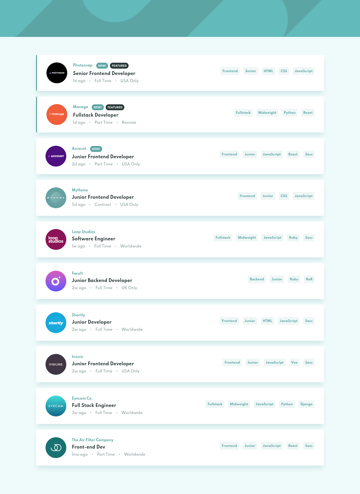

# Filterable Job Listings

My solution to the [**Filterable Job Listings**](https://www.frontendmentor.io/challenges/job-listings-with-filtering-ivstIPCt) challenge on [Frontend Mentor](https://www.frontendmentor.io/)

## Project Specifications

-  Import job listings from a JSON file
-  Display job listings
-  Filter out jobs based on the categories selected
-  List and highlight the active filters
-  Mark featured jobs with a desaturated dark cyan label

## Coded with

-  React
-  TypeScript
-  CSS

Live Site URL: https://fadiyousif.github.io/filterable-job-listings/

